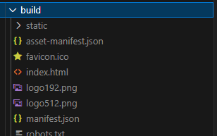

# 第一章 前端项目到底部署的是什么
前端项目部署的都是**静态资源**。有html、css、js、图片、视频等等，这些静态资源通过http协议传输给浏览器，浏览器会解析这些静态资源，并展示给用户。



对于node js服务，部署的是**可执行代码**，是**服务**。
index.js
```console.log('hello world')```

```node index.js```


